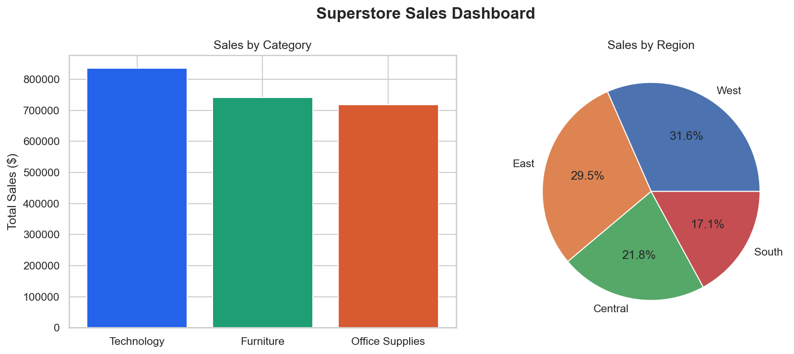

# Superstore Sales Dashboard

## Overview
Analyzed 9,994 sales records from a US retail superstore to identify 
revenue trends, top products, and regional performance using Python and SQL.

## Key Findings
- Technology category generated the highest revenue at $836,154
- West region contributes 31.6% of total sales
- Canon imageCLASS Copier is the most profitable product at $25,199 profit
- Cubify 3D Printer is the biggest loss maker at -$8,879
- November and December are consistently the strongest months every year

## Dashboard Preview

## Tech Stack
- Python
- Pandas
- SQL (SQLite)
- Matplotlib
- Seaborn

## Files
- analysis.py — Data loading and cleaning
- sql_analysis.py — SQL queries for business insights
- charts.py — Dashboard visualization
- clean_superstore.csv — Cleaned dataset

## How To Run
pip install pandas matplotlib seaborn openpyxl
py analysis.py
py sql_analysis.py
py charts.py
